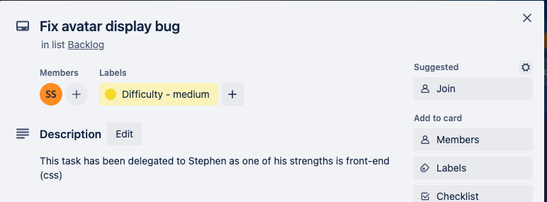
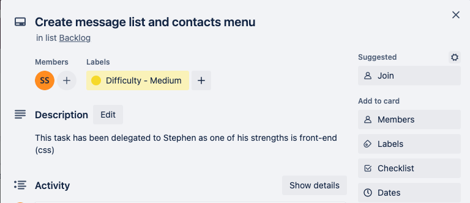
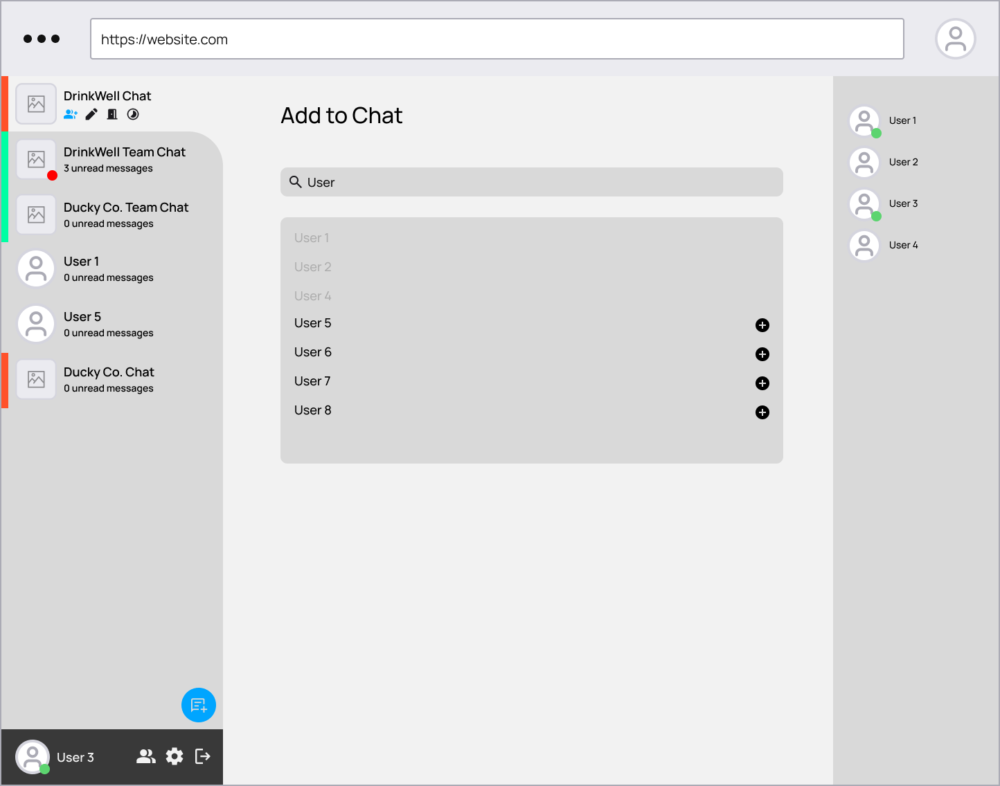

# T3-A2-Part-B

This Repo is the overarching README for the submission of Term 3 Assessment 2 (Part B) by Stephen Smith and Riki Fujihara.

### Link to Frontend Repo: <a href='https://github.com/team-phteven/basil-frontend'>here</a>

### Link to Backend Repo: <a href='https://github.com/team-phteven/basil-backend'>here</a>

# Libraries used

The following libraries were used to create the app.

## Node

### What is Node?

Node is a Javascript runtime built based on Chrome's V8 engine. Javascript could originally only be run in the browser, but Node allows Javascript to be run in servers.

### How is Node used in the project?

Node was used to run the backend of the application. It serves as an API, taking incoming requests and responding with appropriate data/actions.

## Express

### What is Express?

Express is a flexible framework for building web applications which is imported into the Node backend to build out RESTful APIs.

### How is Express used in the project?

Express was used to create the API that handled all incoming requests from the front end.The server instance was created using express, as well as all middleware functions that executed actions in between requests and responses.

## React

### What is React?

React is a Javascript library used for building component-based and stateful front ends.

### How was React used in the project?

React was used to build all front end components in the app including sidebars, modals, avatars, forms and so forth. Context providers were key in keeping the front end in sync with the backend.

## MongoDB

### What is MongoDB?

MongoDB is a no-sql database which stores data by grouping individual 'documents' in 'collections', instead of relational tables.

### How was MongoDB used in the project?

MongoDB was the database of choice for the app.

## Mongoose

### What is Mongoose?

Mongoose is an Object Data Modeling library that creates a connection between MongoDB and Node. Although MongoDB is schemaless, Mongoose provides the ability to create schemas and relations.

### How was Mongoose used in the project?

Mongoose was used to create schemas for the models in the app (User, Conversation, Message) and the relations between them.

## Bcrypt

### What is Bcrypt?

Bcrypt is a password hashing function.

### How was Bcrypt used in the app?

Bcrypt was used to hash passwords entered by users so that the passwords are never stored as plain-text.

## Json web token

### What is Json web token?

Json web token is a library used for generating unique json tokens that are passed between the frontend and backend for authentication.

### How was Json web token used in the project?

Json web tokens were generated for the user upon login to provide authentication for what the user can and can't access.

## Cors

### What is cors?

Cors is a library that is used to configure cross origin resource sharing options.

### How was cors used in the project?

Cors was used to provide the Netlify front end access to make requests to the Heroku backend。

## Dotenv

### What is Dotenv?

Dotenv is a library that gets variables stored in a .env file for use in the source code.

### How was Dotenv used in the app?

Dotenv was used to load environment variables and secrets that should only ever be known by the backend.

## Socket.io

### What is socket.io?

Socket.io is a library used to handle web-sockets in the Node backend.

### How was socket.io used in the project?

Socket.io was used to create the socket actions, responses and events in the Node backend, particularly for responding to incoming instant messages.

## Socket.io-client

### What is socket.io-client?

Socket.io is a library used to handle web-sockets in the front-end.

### How was socket.io-client used in the project?

Socket.io-client was used to create the socket actions, responses and events in the React front end, particularly for emitting events when sending instant messages.

## Validator

### What is Validator?

Validator is a Javascript library used to provide validation of user input.

### How was Validator used in the project?

Validator was used to conveniently validate user input for things such as email validation, which meant complex regex wasn't needed.

## Bootstrap

### What is Bootstrap?

Bootstrap is a css library that provides pre-defined css classes for use on html elements.

### How was Bootstrap used in the project?

Bootstrap was imported into the front-end which enabled the use of react-bootstrap.

## React-bootstrap

### What is React-bootstrap?

React-bootstrap is a library which gives access to React-components styled using bootstrap.

### How was React-bootstrap used in the project?

React-bootstrap was used to create many of the front-end components such as buttons, modals and forms, and was also used to lay out the structure of the front-end using bootstrap's grid system.

## Axios

### What is Axios?

Axios is a library that is used to make HTTP requests.

### How was Axios used in the project?

Axios was used to make requests from the front-end. The requests utilised configuration, headers and promise-based syntax.

## Styled-components

### What is Styled-components?

Styled-components is a library that allows the creation of React components with css styling directly in the component.

### How was Styled-components used in the project?

Styled-components was used to provide css styling directly to react components in the app. It was also used to add to and override the default bootstrap styles provided by Bootstrap and React-bootstrap.

## Jest

### What is Jest?

Jest is a testing framework for Javascript.

### How was Jest used in the project?

Jest was used to create both unit and integration tests for various functions within the app.

## Luxon

### What is Luxon?

Luxon is a javascript library for manipulating and formatting dates in Javascript.

### How was Luxon used in the project?

Luxon was used particularly for formatting times that messages were sent.

## React-icons

### What is React-icons?

React-icons is a library that provides access to a huge selection of different icons that can be used in React front ends.

### How was React-icons used in the project?

React-icons was used to enhance the user interface by providing visually appealing images instead of text for some buttons and toggles.

# User Testing (in development)

# User Testing (in production)

# Project Management and Task Delegation Methodology

The Agile project management methodology was utilised in this project. Work was organised into sprints and executed accordingly. Tasks were delegated based on strengths and weaknesses of team members.

## First Sprint

## Second Sprint

## Third Sprint

## Fourth Sprint

## Fifth Sprint

## Sixth Sprint

## Seventh Sprint

## Eighth Sprint

# Part A Documentation

# Website Description

## Purpose

The purpose of this app is to help marketing agencies to maintain their labour inventory records in order to accurately charge for their services. There is current software on the market that is used by agencies to track billable hours, but it can be restrictive or not modular enough. This app aims to solve a specific issue relating to the tracking of billable hours on in-text conversations.

## Functionality / features

The app will function mainly as a live chat app. The main features include:

-   Authentication
-   Creation of contacts
-   Creation of conversations
-   Sending messages
-   Receiving messages
-   Timing of chat time
-   Retrieval of chat times

## Target audience

The target audience of this app is agency owners/employees and their clients.

## Tech stack

The tech stack will include:

-   MongoDB
-   Express
-   React
-   Node.js
-   Heroku
-   JWT
-   Netlify

# Dataflow Diagram

# Application Architecture

# User Stories

## Persona 1 (Marketing Agency Owner)

### Lauren

Lauren is a 39 year old founder / sole director of a boutique marketing agency. She began working in the marketing industry 18 years ago, originally focusing on Events / PR and communications but has had a variety of roles since. While working on a breast cancer campaign for a hospital, Lauren discovered the importance of branding and developed a passion for helping people get their message heard, one of the main reasons she started her own agency 4 years ago. Lauren goes to galleries on the weekend (if she has the time) and lives in Melbourne in her 3 bedroom house with her partner and their 2 year old.

### Job Description

As her agency has grown, Lauren has spent less time working directly with clients and more time managing her team and developing new business opportunities. Although she's able to delegate many responsibilities, she still has a huge workload having to manage business development, hiring and overall operational management. Lauren believes it is her responsibility to make sure her clients are happy, while also ensuring her staff are comfortable and effective in their roles.

### Professional Goals

Lauren has worked incredibly hard to build her agency, and is professionally satisfied. Over the next decade she hopes to build her team by a few more employees and gradually offload more and more of her responsibilities onto capable leaders within her team. She hopes that by offloading some of her current work she will have time to work more closely with clients again and inject some of her own creativity back into projects. Lauren loves her team and wants to nurture their growth the best she can.

### Motivators

Lauren is proud to be an independent business owner, and enjoys building relationships in her team - the biggest motivator for her is to have a strong team to which she feels connected.

### Challenges

Although she is extremely passionate about her team and her work, Lauren sometimes feels that her responsibilities as the owner of an agency consumes more of her time than she would like. She has had clients mention that although her team is fantastic, they would like to spend more time with Lauren personally, and see more of her own creative input. Lauren's biggest challenge is communicating how important marketing is for growing businesses; she has discovered that marketing is often the first expense to be cut from a tight budget, but believes that this shouldn't always be the case.

## Lauren's user stories

### Logging in to the app

Lauren wants to log in to the app so that she can access its features.

### Signing out of the app

Lauren wants to sign out of the app so she can have peace of mind that nobody else can use her credentials while she's logged out.

### Create contacts

Lauren wants to create contacts so that she can message them and know their identity.

### Create conversations

~~Lauren wants to create conversations so that she can find a way to reach her team.~~
Lauren wants to create conversations so that she can send messages to her clients and team.

### Send messages

Lauren wants to send messages within conversations created between her clients and team, so that she can communicate information to them.

### Receive messages

Lauren wants to receive messages so she can see information communicated to her by her clients and team.

### Search for past messages

~~Lauren wants to search for past messages in her conversations, in case she forgets something a client said to her.~~
Lauren wants to search for past messages in her conversations, so that she can retrieve information or media that she's forgotten the details of.

### See the total billable hours for a given time period

~~Lauren wants to be able to view the total billable hours across all of her employees across a certain time period so that she can assess the overall performance of her agency.~~
Lauren wants to be able to view the total billable hours across all of her employees across a certain time period so that she can assess the overall performance of her agency.

### See the total hours billed for a specific client

Lauren wants to view the total hours billed for a specific client by all employees so her bookkeeper can invoice the customer the correct amount.

## Persona 2 (Marketing Agency Employee)

### Kate

Kate is a 27 year old employee of a marketing agency. She originally studied a bachelor of photography, and after working as a photographer on several fashion marketing campaigns, decided that she wanted more to do with the entire creative process. After studying marketing at a renowned university and graduating with honours, Kate was quickly hired by an agency that valued her previous creative experience on top of her excellent academic record. Kate lives in a two-bedroom apartment in Melbourne and has a cat which she adores. Kate likes to meet up with friends, go on hikes and binge true-crime on online streaming services.

### Job Description

Kate consults with clients directly to provide advice on their current marketing practices. She analyzes several aspects such as overall branding, social media content & engagement, website & SEO, E-mail marketing, Google & Facebook advertising, and more. Focusing on these key aspects, Kate helps her clients to identify and engage with their target audience, while improving their overall branding and message. On top of strategic services, Kate may also deliver for her clients: original social media content (image and video), copy writing, ad creation & implementation, branding packages and marketing reports. Kate is always available for contact with her clients during business hours.

### Professional Goals

Kate is a highly ambitious individual who plans to progress into a senior management position at her employing agency and has a 10 year goal of becoming an agency owner. To do this, Kate is developing her leadership, management and stakeholder organisation skills. She also attends marketing conferences and events to continually build her professional network.

### Motivators

Kate enjoys working at her current agency as an employee, but she wants to feel the truest sense of ownership possible over her work which is why she wants to eventually own her own agency. She loves to work with people, move projects forward and exercise discernment. She likes to work on complex projects where she can utilie her problem solving skills, and her favourite clients are those with a unique product or brand story which she feels excited to help communicate to the market.

### Challenges

Being as ambitious as she is, Kate sometimes struggles to balance work and life. This means she often feels torn between allocating free time towards career progression or leisure.

## Lauren's user stories

### Logging in to the app

Kate wants to log in to the app so that she can access its features.

### Signing out of the app

Kate wants to sign out of the app so she can have peace of mind that nobody else can use her credentials while she's logged out.

### Create contacts

Kate wants to create contacts so that she can message them and know their identity.

### Create conversation channels

~~Kate wants to create conversations so she can send messages to her clients.~~
Kate wants to create conversations so she can send messages to her clients and team.

### Send messages

Kate wants to send messages within conversations created with her clients and team so she can communicate information to them.

### Receive messages

~~Kate wants to receive messages so she can see information communicated to her by her clients.~~
Kate wants to receive messages so she can see information communicated to her by her clients and team.

### Search for past messages

Kate wants to search for past messages in her conversations so she can retrieve information or media.

### Timing billable hours

~~Kate wants to time her billable hours so that the agency owner knows how much to bill her client.~~
Kate wants to time her billable hours so that the agency owner knows how much to bill her client, and to stay accountable for the hours that she's charging.

### View personal hours billed

Kate wants to view her hours that she's billed to clients in case she needs to verify against a client's records of billable hours.

## Persona 3 (Marketing Agency Client)

### Ross

Ross is a 32 year old freelance architect. He worked for many years under an experienced architect working mainly in residential housing. After 9 years working under other architects, he decided to try getting his own clients and eventually had a large enough client base to freelance full time. He lives in inner-city Melbourne in a two-bedroom flat with his partner.

### Job Description

Ross freelances full-time so is essentially running his own business. He has to cover all business functions such as accounting, account management and business development all on top of his responsibilities as an architect on a project.

### Professional Goals

Ross enjoys his work as a freelancer and is happy with his current professional life - he sometimes considers starting his own agency sometime in the future so that he can pass on his knowledge to young architects but is otherwise content.

### Motivators

Ross moved to freelancing so that he could make all decisions on his own accord and have full autonomy over his work. He is motivated by freedom, flexibility of his work hours and working on engaging, challenging projects. Another big motivator for Ross is affordability, he is always reconsidering whether the services he pays for are worth the investment.

### Challenges

As a freelancer, his biggest worry is job security. He has to spend lots of his time doing business development to make sure that he has a reliable flow of work coming his way. Sometimes he struggles to balance his time between developing new business and maintaining his existing relationships.

## Ross' user stories

### Logging in to the app

Ross wants to log in to the app so that he can access its features.

### Signing out of the app

Ross wants to sign out of the app so he can have peace of mind that nobody else can use his credentials while he's logged out.

### Send messages

Ross wants to send messages into conversations created by agency employees so that he can communicate with the agency employees.

### Receive messages

~~Ross wants to receive messages so he can see information communicated to him by agency employees.~~
Ross wants to receive messages so he can see information communicated to him by agency employees and receive updates on deliverables.

### Search for past messages

~~Ross wants to search for past messages in his conversations so he can retrieve information or media.~~
Ross wants to search for past messages in his conversations so he can retrieve information or media and verify things told to him by agency employees.

### View hours billed

Ross wants to view the hours that he's been billed by agencies in case he wants to verify against an agency employee's records of billable hours.

# Wireframes

(wireframes of design)

# Project planning (Trello)

## Phase 1 - Definition of Deliverables

This phase of planning using Trello included assessing the overall scope of the requirements for the planning process of the final project. Due dates and deliverable checklists were used to create an early overview of criteria required and an estimated plan of execution timelines.

## Overview (before commencement)

## Overview (mid-project)

## Overview (after completion)

## Cards

### Interview

### Interview (complete)

### Problem Statement

### Website Description

### Website Description (complete)

### Dataflow Diagram

### Dataflow Diagram (complete)

### Application Architecture Diagram

### Application Architecture Diagram (complete)

### User Stories

### User Stories (complete)

### Wireframes

### Wireframes (complete)

# References

Atlassian (2022) User stories with examples and a template, Atlassian website, accessed 24 October 2022. https://www.atlassian.com/agile/project-management/user-stories

Atlassian (2022) Persona template, Atlassian website, accessed 24 October 2022. https://www.atlassian.com/software/confluence/templates/persona
